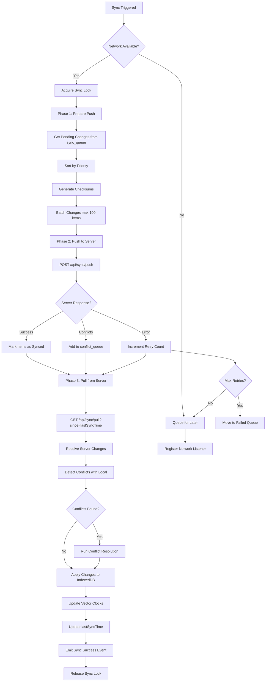

# Synchronization Strategy

## Overview

This document details the complete synchronization strategy for the offline-first task management system, including sync algorithms, conflict detection, priority management, and optimization techniques.

---

## Sync Architecture Philosophy

### Core Principles

1. **Delta Sync**: Only changed entities are transmitted
2. **Bidirectional**: Both push and pull operations in every sync cycle
3. **Atomic Batches**: Sync operations grouped into transactional batches
4. **Priority-Based**: Critical changes sync first
5. **Idempotent**: Sync operations can be safely retried
6. **Causality Preservation**: Vector clocks maintain operation ordering

---

## Vector Clock Implementation

### What are Vector Clocks?

Vector clocks track causality between distributed events. Each device maintains a counter for itself and knows about other devices' counters.

### Structure

```typescript
type VectorClock = Record<string, number>; // deviceId -> counter

// Example:
{
  "device-a123": 42,
  "device-b456": 18,
  "device-c789": 7
}
```

### Operations

**1. Increment on Local Change:**
```typescript
function incrementVectorClock(
  deviceId: string,
  currentClock: VectorClock
): VectorClock {
  return {
    ...currentClock,
    [deviceId]: (currentClock[deviceId] || 0) + 1
  };
}
```

**2. Merge on Sync:**
```typescript
function mergeVectorClocks(
  local: VectorClock,
  remote: VectorClock
): VectorClock {
  const allDevices = new Set([
    ...Object.keys(local),
    ...Object.keys(remote)
  ]);

  const merged: VectorClock = {};
  for (const deviceId of allDevices) {
    merged[deviceId] = Math.max(
      local[deviceId] || 0,
      remote[deviceId] || 0
    );
  }
  return merged;
}
```

**3. Compare for Conflicts:**
```typescript
enum ClockRelation {
  EQUAL,
  BEFORE,
  AFTER,
  CONCURRENT
}

function compareVectorClocks(
  clock1: VectorClock,
  clock2: VectorClock
): ClockRelation {
  const allDevices = new Set([
    ...Object.keys(clock1),
    ...Object.keys(clock2)
  ]);

  let clock1Greater = false;
  let clock2Greater = false;

  for (const deviceId of allDevices) {
    const v1 = clock1[deviceId] || 0;
    const v2 = clock2[deviceId] || 0;

    if (v1 > v2) clock1Greater = true;
    if (v2 > v1) clock2Greater = true;
  }

  if (clock1Greater && clock2Greater) return ClockRelation.CONCURRENT;
  if (clock1Greater) return ClockRelation.AFTER;
  if (clock2Greater) return ClockRelation.BEFORE;
  return ClockRelation.EQUAL;
}
```

---

## Sync Cycle Flow

### Complete Sync Sequence



---

## Sync Triggers

### Automatic Triggers

1. **Network State Change**: Online after being offline
2. **Periodic Polling**: Every 30 seconds when online
3. **User Action**: After creating/updating entities (debounced 2s)
4. **Page Focus**: When user returns to tab
5. **Page Load**: On application startup

### Manual Triggers

1. **User Refresh**: Pull-to-refresh gesture
2. **Conflict Resolution**: After user resolves conflict
3. **Reconnect Button**: Explicit sync button click

### Implementation

```typescript
class SyncScheduler {
  private syncInProgress = false;
  private syncTimer: NodeJS.Timeout | null = null;
  private pendingSync = false;

  constructor(private syncEngine: SyncEngine) {
    this.registerTriggers();
  }

  private registerTriggers() {
    // Network state change
    window.addEventListener('online', () => this.triggerSync('network'));

    // Periodic polling
    this.startPeriodicSync();

    // User activity (debounced)
    this.debounceUserActivity();

    // Page focus
    document.addEventListener('visibilitychange', () => {
      if (!document.hidden) {
        this.triggerSync('focus');
      }
    });

    // Page load
    if (navigator.onLine) {
      this.triggerSync('startup');
    }
  }

  private startPeriodicSync() {
    this.syncTimer = setInterval(() => {
      if (navigator.onLine) {
        this.triggerSync('periodic');
      }
    }, 30000); // 30 seconds
  }

  async triggerSync(source: string): Promise<void> {
    if (this.syncInProgress) {
      this.pendingSync = true;
      return;
    }

    this.syncInProgress = true;
    this.pendingSync = false;

    try {
      await this.syncEngine.runSyncCycle(source);
    } finally {
      this.syncInProgress = false;

      // Run pending sync if queued
      if (this.pendingSync) {
        setTimeout(() => this.triggerSync('queued'), 1000);
      }
    }
  }
}
```

---

## Priority System

### Priority Levels

| Priority | Value | Description | Examples |
|----------|-------|-------------|----------|
| Critical | 1 | User-blocking operations | Task creation, status changes |
| High | 2 | Important updates | Assignment changes, title edits |
| Medium | 3 | Regular updates | Description edits, due date changes |
| Low | 4 | Non-critical changes | Tag updates, position changes |
| Background | 5 | Bulk operations | History tracking, analytics |

### Priority Assignment Rules

```typescript
function calculateSyncPriority(
  entityType: string,
  operation: string,
  changes: Record<string, any>
): number {
  // Critical: New entity creation
  if (operation === 'create') return 1;

  // Critical: Task status changes
  if (entityType === 'task' && 'status' in changes) return 1;

  // High: Assignment changes
  if (entityType === 'task' && 'assignedTo' in changes) return 2;

  // High: Title/name changes (visible to users)
  if ('title' in changes || 'name' in changes) return 2;

  // High: Comment creation/deletion
  if (entityType === 'comment' && operation !== 'update') return 2;

  // Medium: Content updates
  if ('description' in changes || 'content' in changes) return 3;

  // Medium: Date changes
  if ('dueDate' in changes || 'completedAt' in changes) return 3;

  // Low: Metadata changes
  if ('tags' in changes || 'customFields' in changes) return 4;

  // Background: Everything else
  return 5;
}
```

---

## Change Detection

### Client-Side Change Tracking

**1. Track Modifications:**
```typescript
class TaskRepository {
  private db: IDBDatabase;
  private syncQueue: SyncQueue;

  async updateTask(taskId: string, changes: Partial<Task>): Promise<Task> {
    const tx = this.db.transaction(['tasks', 'sync_queue'], 'readwrite');
    const taskStore = tx.objectStore('tasks');

    // Get current task
    const currentTask = await taskStore.get(taskId);
    if (!currentTask) throw new Error('Task not found');

    // Increment vector clock
    const deviceId = await getDeviceId();
    const newVectorClock = incrementVectorClock(deviceId, currentTask.vectorClock);

    // Calculate checksum for change detection
    const updatedTask = {
      ...currentTask,
      ...changes,
      vectorClock: newVectorClock,
      updatedAt: Date.now(),
      version: currentTask.version + 1,
      lastModifiedBy: await getCurrentUserId(),
      lastModifiedDevice: deviceId,
      _locallyModified: true,
      _syncStatus: 'pending'
    };

    updatedTask.checksum = calculateChecksum(updatedTask);

    // Save updated task
    await taskStore.put(updatedTask);

    // Add to sync queue
    await this.syncQueue.enqueue({
      entityType: 'task',
      entityId: taskId,
      operation: 'update',
      priority: calculateSyncPriority('task', 'update', changes),
      payload: updatedTask,
      createdAt: Date.now()
    });

    await tx.commit();
    return updatedTask;
  }
}
```

**2. Generate Checksums:**
```typescript
async function calculateChecksum(entity: any): Promise<string> {
  // Stable serialization (sorted keys)
  const normalized = JSON.stringify(entity, Object.keys(entity).sort());

  // SHA-256 hash
  const msgUint8 = new TextEncoder().encode(normalized);
  const hashBuffer = await crypto.subtle.digest('SHA-256', msgUint8);
  const hashArray = Array.from(new Uint8Array(hashBuffer));
  return hashArray.map(b => b.toString(16).padStart(2, '0')).join('');
}
```

---

### Server-Side Change Detection

**1. Track Last Sync Timestamp:**
```sql
-- Get changes since last sync for device
SELECT
  id,
  title,
  status,
  assigned_to,
  vector_clock,
  version,
  updated_at,
  deleted_at IS NOT NULL as is_deleted
FROM tasks
WHERE organization_id = $1
  AND updated_at > $2 -- Last sync timestamp
  AND last_modified_device != $3 -- Exclude device's own changes
ORDER BY updated_at ASC
LIMIT 100;
```

**2. Conflict Detection:**
```sql
-- Check if entity was modified since client last saw it
SELECT
  id,
  vector_clock,
  version,
  updated_at
FROM tasks
WHERE id = $1
  AND version > $2 -- Client's version
  AND updated_at > $3; -- Client's last update time
```

---

## Sync Operations

### Push Operation

**Client Implementation:**

```typescript
class SyncEngine {
  async push(): Promise<PushResult> {
    // 1. Get pending changes from queue
    const pendingItems = await this.syncQueue.getPending(100);
    if (pendingItems.length === 0) {
      return { success: true, pushed: 0, conflicts: [] };
    }

    // 2. Group by entity type
    const grouped = this.groupByEntityType(pendingItems);

    // 3. Build payload
    const payload = {
      deviceId: await getDeviceId(),
      changes: grouped,
      vectorClock: await this.getLocalVectorClock(),
      timestamp: Date.now()
    };

    // 4. Send to server
    try {
      const response = await this.apiClient.post('/api/sync/push', payload);

      // 5. Handle response
      await this.handlePushResponse(response, pendingItems);

      return {
        success: true,
        pushed: pendingItems.length,
        conflicts: response.conflicts || []
      };
    } catch (error) {
      // Mark items for retry
      await this.handlePushError(error, pendingItems);
      throw error;
    }
  }

  private async handlePushResponse(
    response: PushResponse,
    items: SyncQueueItem[]
  ): Promise<void> {
    const tx = this.db.transaction(['sync_queue', 'conflict_queue'], 'readwrite');

    for (const item of items) {
      const conflict = response.conflicts.find(
        c => c.entityId === item.entityId
      );

      if (conflict) {
        // Add to conflict queue
        await tx.objectStore('conflict_queue').add({
          id: generateId(),
          entityType: item.entityType,
          entityId: item.entityId,
          localVersion: item.payload,
          serverVersion: conflict.serverVersion,
          localVectorClock: item.payload.vectorClock,
          serverVectorClock: conflict.serverVectorClock,
          conflictReason: conflict.reason,
          autoResolvable: this.isAutoResolvable(conflict),
          createdAt: Date.now(),
          userNotified: false
        });
      }

      // Remove from sync queue
      await tx.objectStore('sync_queue').delete(item.id);
    }

    await tx.commit();
  }
}
```

**Server Implementation:**

```typescript
// POST /api/sync/push
async function handlePush(req: Request, res: Response) {
  const { deviceId, changes, vectorClock, timestamp } = req.body;
  const userId = req.user.id;
  const organizationId = req.user.organizationId;

  const conflicts: Conflict[] = [];
  const processed: string[] = [];

  const pgClient = await pool.connect();

  try {
    await pgClient.query('BEGIN');

    // Process each entity type
    for (const [entityType, entities] of Object.entries(changes)) {
      for (const entity of entities as any[]) {
        try {
          // Validate permissions
          await validatePermissions(userId, organizationId, entityType, entity);

          // Check for conflicts
          const conflict = await detectConflict(pgClient, entity, vectorClock);

          if (conflict) {
            conflicts.push(conflict);
            continue;
          }

          // Apply change
          await applyChange(pgClient, entityType, entity, deviceId);
          processed.push(entity.id);

        } catch (error) {
          console.error(`Error processing ${entityType} ${entity.id}:`, error);
          // Continue with other entities
        }
      }
    }

    // Update device sync metadata
    await pgClient.query(
      `UPDATE devices
       SET last_sync_at = NOW(),
           vector_clock = $1
       WHERE id = $2`,
      [JSON.stringify(vectorClock), deviceId]
    );

    // Log sync event
    await pgClient.query(
      `INSERT INTO sync_logs (id, device_id, user_id, sync_type, entities_pushed, conflicts_detected, status, created_at)
       VALUES ($1, $2, $3, 'push', $4, $5, 'success', NOW())`,
      [generateId(), deviceId, userId, processed.length, conflicts.length]
    );

    await pgClient.query('COMMIT');

    res.json({
      success: true,
      processed: processed.length,
      conflicts,
      serverVectorClock: await getServerVectorClock(organizationId)
    });

  } catch (error) {
    await pgClient.query('ROLLBACK');
    console.error('Push sync error:', error);
    res.status(500).json({ error: 'Sync failed' });
  } finally {
    pgClient.release();
  }
}

async function detectConflict(
  client: PoolClient,
  entity: any,
  clientVectorClock: VectorClock
): Promise<Conflict | null> {
  // Get current server version
  const result = await client.query(
    `SELECT vector_clock, version, updated_at
     FROM ${entity.entityType}s
     WHERE id = $1`,
    [entity.id]
  );

  if (result.rows.length === 0) return null;

  const serverEntity = result.rows[0];
  const relation = compareVectorClocks(
    entity.vectorClock,
    serverEntity.vector_clock
  );

  if (relation === ClockRelation.CONCURRENT) {
    return {
      entityType: entity.entityType,
      entityId: entity.id,
      serverVersion: serverEntity,
      serverVectorClock: serverEntity.vector_clock,
      reason: 'Concurrent modification detected'
    };
  }

  return null;
}
```

---

### Pull Operation

**Client Implementation:**

```typescript
async pull(): Promise<PullResult> {
  // 1. Get last sync timestamp
  const lastSyncTime = await this.getLastSyncTime();
  const deviceId = await getDeviceId();

  // 2. Request changes from server
  const response = await this.apiClient.get('/api/sync/pull', {
    params: {
      since: lastSyncTime,
      deviceId,
      limit: 100
    }
  });

  // 3. Process changes
  const { tasks, comments, attachments, tombstones } = response.data;

  const tx = this.db.transaction(
    ['tasks', 'comments', 'attachments', 'tombstones', 'cache_metadata'],
    'readwrite'
  );

  let applied = 0;
  const conflicts: Conflict[] = [];

  // 4. Apply tasks
  for (const task of tasks) {
    const conflict = await this.applyRemoteTask(tx, task);
    if (conflict) {
      conflicts.push(conflict);
    } else {
      applied++;
    }
  }

  // 5. Apply comments
  for (const comment of comments) {
    await this.applyRemoteComment(tx, comment);
    applied++;
  }

  // 6. Apply attachments
  for (const attachment of attachments) {
    await this.applyRemoteAttachment(tx, attachment);
    applied++;
  }

  // 7. Process tombstones (deletions)
  for (const tombstone of tombstones) {
    await this.applyTombstone(tx, tombstone);
    applied++;
  }

  // 8. Update last sync time
  await tx.objectStore('cache_metadata').put({
    key: 'lastSyncTime',
    value: Date.now(),
    updatedAt: Date.now()
  });

  await tx.commit();

  return {
    success: true,
    pulled: applied,
    conflicts
  };
}

private async applyRemoteTask(
  tx: IDBTransaction,
  remoteTask: Task
): Promise<Conflict | null> {
  const taskStore = tx.objectStore('tasks');
  const localTask = await taskStore.get(remoteTask.id);

  if (!localTask) {
    // New task from server
    await taskStore.put({
      ...remoteTask,
      _syncStatus: 'synced',
      _locallyModified: false
    });
    return null;
  }

  // Check if local has pending changes
  if (localTask._locallyModified) {
    const relation = compareVectorClocks(
      localTask.vectorClock,
      remoteTask.vectorClock
    );

    if (relation === ClockRelation.CONCURRENT) {
      // Conflict detected
      return {
        entityType: 'task',
        entityId: remoteTask.id,
        localVersion: localTask,
        serverVersion: remoteTask,
        localVectorClock: localTask.vectorClock,
        serverVectorClock: remoteTask.vectorClock,
        conflictReason: 'Concurrent modification'
      };
    }
  }

  // Server version is newer, apply it
  await taskStore.put({
    ...remoteTask,
    _syncStatus: 'synced',
    _locallyModified: false
  });

  return null;
}
```

**Server Implementation:**

```typescript
// GET /api/sync/pull
async function handlePull(req: Request, res: Response) {
  const { since, deviceId, limit = 100 } = req.query;
  const userId = req.user.id;
  const organizationId = req.user.organizationId;

  try {
    // 1. Get changed tasks
    const tasks = await pool.query(
      `SELECT * FROM tasks
       WHERE organization_id = $1
         AND updated_at > $2
         AND last_modified_device != $3
         AND deleted_at IS NULL
       ORDER BY updated_at ASC
       LIMIT $4`,
      [organizationId, new Date(since as string), deviceId, limit]
    );

    // 2. Get changed comments
    const comments = await pool.query(
      `SELECT c.* FROM comments c
       JOIN tasks t ON c.task_id = t.id
       WHERE t.organization_id = $1
         AND c.updated_at > $2
         AND c.last_modified_device != $3
         AND c.deleted_at IS NULL
       ORDER BY c.updated_at ASC
       LIMIT $4`,
      [organizationId, new Date(since as string), deviceId, limit]
    );

    // 3. Get changed attachments
    const attachments = await pool.query(
      `SELECT a.* FROM attachments a
       JOIN tasks t ON a.task_id = t.id
       WHERE t.organization_id = $1
         AND a.updated_at > $2
         AND a.uploaded_from_device != $3
         AND a.deleted_at IS NULL
       ORDER BY a.created_at ASC
       LIMIT $4`,
      [organizationId, new Date(since as string), deviceId, limit]
    );

    // 4. Get tombstones (deletions)
    const tombstones = await pool.query(
      `SELECT * FROM tombstones
       WHERE organization_id = $1
         AND created_at > $2
         AND deleted_from_device != $3
         AND expires_at > NOW()
       ORDER BY created_at ASC
       LIMIT $4`,
      [organizationId, new Date(since as string), deviceId, limit]
    );

    // 5. Get server vector clock
    const serverVectorClock = await getOrganizationVectorClock(organizationId);

    res.json({
      tasks: tasks.rows,
      comments: comments.rows,
      attachments: attachments.rows,
      tombstones: tombstones.rows,
      serverVectorClock,
      hasMore: tasks.rows.length === limit,
      timestamp: Date.now()
    });

  } catch (error) {
    console.error('Pull sync error:', error);
    res.status(500).json({ error: 'Pull sync failed' });
  }
}
```

---

## Batching Strategy

### Client-Side Batching

```typescript
class SyncQueue {
  async getPending(limit: number): Promise<SyncQueueItem[]> {
    const tx = this.db.transaction('sync_queue', 'readonly');
    const index = tx.objectStore('sync_queue').index('status_priority');

    // Get items sorted by priority
    const items: SyncQueueItem[] = [];
    const range = IDBKeyRange.bound(['pending', 1], ['pending', 5]);

    let cursor = await index.openCursor(range);

    while (cursor && items.length < limit) {
      const item = cursor.value;

      // Skip items in retry backoff
      if (this.shouldRetry(item)) {
        items.push(item);
      }

      cursor = await cursor.continue();
    }

    return items;
  }

  private shouldRetry(item: SyncQueueItem): boolean {
    if (item.retryCount === 0) return true;

    // Exponential backoff: 2^retryCount seconds
    const backoffMs = Math.pow(2, item.retryCount) * 1000;
    const nextRetryTime = item.lastAttemptAt + backoffMs;

    return Date.now() >= nextRetryTime;
  }
}
```

### Server-Side Batching

```typescript
// Batch size limits
const BATCH_LIMITS = {
  tasks: 100,
  comments: 200,
  attachments: 50,
  tombstones: 100
};

// Process in multiple round trips if needed
async function pullWithPagination(
  apiClient: ApiClient,
  lastSyncTime: number
): Promise<void> {
  let hasMore = true;
  let currentOffset = 0;

  while (hasMore) {
    const response = await apiClient.get('/api/sync/pull', {
      params: {
        since: lastSyncTime,
        offset: currentOffset,
        limit: 100
      }
    });

    await applyChanges(response.data);

    hasMore = response.data.hasMore;
    currentOffset += 100;

    // Throttle to avoid overwhelming client
    if (hasMore) {
      await sleep(500);
    }
  }
}
```

---

## Optimization Techniques

### 1. Incremental Sync

Only sync entities that have changed:

```typescript
// Track sync watermarks per entity type
interface SyncWatermarks {
  tasks: number;
  comments: number;
  attachments: number;
}

async function incrementalPull(
  watermarks: SyncWatermarks
): Promise<void> {
  // Pull tasks changed since their watermark
  const tasks = await apiClient.get('/api/sync/pull/tasks', {
    params: { since: watermarks.tasks }
  });

  // Pull comments independently
  const comments = await apiClient.get('/api/sync/pull/comments', {
    params: { since: watermarks.comments }
  });

  // Parallel processing
  await Promise.all([
    applyTasks(tasks),
    applyComments(comments)
  ]);
}
```

---

### 2. Compression

Compress large payloads:

```typescript
// Client sends compressed payload
const payload = {
  deviceId,
  changes: largeChangesObject
};

const compressed = await compressPayload(payload);

await apiClient.post('/api/sync/push', compressed, {
  headers: {
    'Content-Encoding': 'gzip',
    'Content-Type': 'application/json'
  }
});

async function compressPayload(data: any): Promise<Blob> {
  const json = JSON.stringify(data);
  const stream = new Blob([json]).stream();
  const compressedStream = stream.pipeThrough(
    new CompressionStream('gzip')
  );
  return new Response(compressedStream).blob();
}
```

---

### 3. Smart Conflict Avoidance

Lock entities during sync:

```typescript
class OptimisticLockManager {
  private locks = new Map<string, Promise<void>>();

  async withLock<T>(
    entityId: string,
    operation: () => Promise<T>
  ): Promise<T> {
    // Wait for existing lock
    if (this.locks.has(entityId)) {
      await this.locks.get(entityId);
    }

    // Create new lock
    const lockPromise = (async () => {
      try {
        return await operation();
      } finally {
        this.locks.delete(entityId);
      }
    })();

    this.locks.set(entityId, lockPromise as Promise<void>);
    return lockPromise as Promise<T>;
  }
}
```

---

### 4. Prefetching

Anticipate user needs:

```typescript
class PrefetchManager {
  async prefetchRelatedData(taskId: string): Promise<void> {
    const task = await taskStore.get(taskId);

    // Prefetch in background
    Promise.all([
      this.prefetchComments(taskId),
      this.prefetchAttachments(taskId),
      this.prefetchAssignedUser(task.assignedTo)
    ]);
  }

  private async prefetchComments(taskId: string): Promise<void> {
    // Check if comments are cached
    const cached = await commentStore.index('taskId').getAll(taskId);
    if (cached.length > 0) return;

    // Fetch from server
    const comments = await apiClient.get(`/api/tasks/${taskId}/comments`);
    await commentStore.bulkPut(comments);
  }
}
```

---

## Error Handling & Retry Logic

### Retry Strategy

```typescript
interface RetryConfig {
  maxRetries: number;
  baseDelay: number; // milliseconds
  maxDelay: number;
  backoffFactor: number;
}

const DEFAULT_RETRY_CONFIG: RetryConfig = {
  maxRetries: 5,
  baseDelay: 1000,
  maxDelay: 60000,
  backoffFactor: 2
};

async function withRetry<T>(
  operation: () => Promise<T>,
  config: RetryConfig = DEFAULT_RETRY_CONFIG
): Promise<T> {
  let lastError: Error;

  for (let attempt = 0; attempt <= config.maxRetries; attempt++) {
    try {
      return await operation();
    } catch (error) {
      lastError = error as Error;

      // Don't retry on client errors (4xx)
      if (error.response?.status >= 400 && error.response?.status < 500) {
        throw error;
      }

      if (attempt < config.maxRetries) {
        const delay = Math.min(
          config.baseDelay * Math.pow(config.backoffFactor, attempt),
          config.maxDelay
        );

        console.log(`Retry attempt ${attempt + 1} after ${delay}ms`);
        await sleep(delay);
      }
    }
  }

  throw lastError!;
}
```

### Circuit Breaker

```typescript
class CircuitBreaker {
  private failureCount = 0;
  private lastFailureTime = 0;
  private state: 'closed' | 'open' | 'half-open' = 'closed';

  constructor(
    private threshold = 5,
    private timeout = 60000
  ) {}

  async execute<T>(operation: () => Promise<T>): Promise<T> {
    if (this.state === 'open') {
      if (Date.now() - this.lastFailureTime > this.timeout) {
        this.state = 'half-open';
      } else {
        throw new Error('Circuit breaker is open');
      }
    }

    try {
      const result = await operation();
      this.onSuccess();
      return result;
    } catch (error) {
      this.onFailure();
      throw error;
    }
  }

  private onSuccess() {
    this.failureCount = 0;
    this.state = 'closed';
  }

  private onFailure() {
    this.failureCount++;
    this.lastFailureTime = Date.now();

    if (this.failureCount >= this.threshold) {
      this.state = 'open';
    }
  }
}
```

---

## Performance Monitoring

### Sync Metrics

```typescript
interface SyncMetrics {
  syncDuration: number;
  entitiesPushed: number;
  entitiesPulled: number;
  conflictsDetected: number;
  bytesTransferred: number;
  networkLatency: number;
}

class SyncMonitor {
  private metrics: SyncMetrics[] = [];

  recordSync(metrics: SyncMetrics) {
    this.metrics.push(metrics);

    // Keep last 100 syncs
    if (this.metrics.length > 100) {
      this.metrics.shift();
    }

    // Send to analytics
    this.sendToAnalytics(metrics);
  }

  getAverages() {
    const sum = this.metrics.reduce(
      (acc, m) => ({
        syncDuration: acc.syncDuration + m.syncDuration,
        entitiesPushed: acc.entitiesPushed + m.entitiesPushed,
        entitiesPulled: acc.entitiesPulled + m.entitiesPulled,
        conflictsDetected: acc.conflictsDetected + m.conflictsDetected
      }),
      { syncDuration: 0, entitiesPushed: 0, entitiesPulled: 0, conflictsDetected: 0 }
    );

    const count = this.metrics.length;
    return {
      avgSyncDuration: sum.syncDuration / count,
      avgPushed: sum.entitiesPushed / count,
      avgPulled: sum.entitiesPulled / count,
      avgConflicts: sum.conflictsDetected / count
    };
  }
}
```

---

**Next Document**: CONFLICT_RESOLUTION.md
