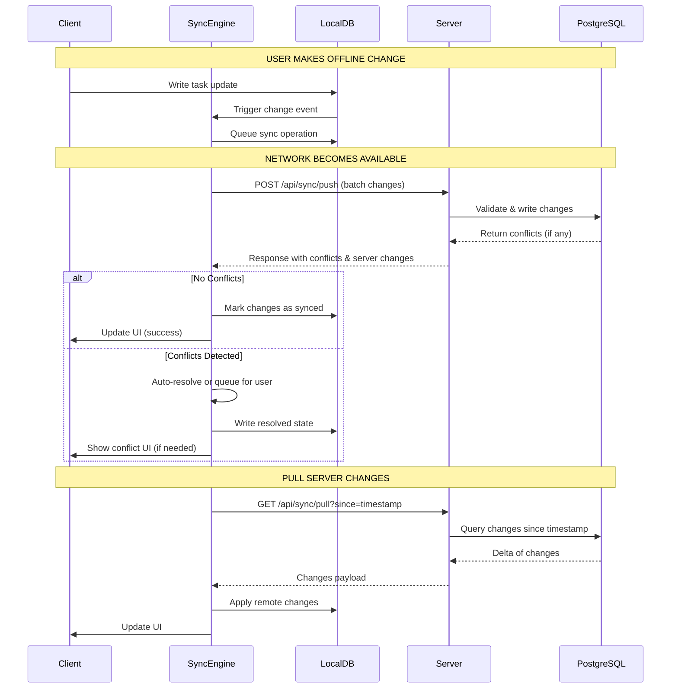

# Offline-First Task Management Architecture

## Executive Summary

This architecture implements a robust offline-first collaborative task management system using a hybrid sync strategy combining **Operational Transformation (OT)** for text fields and **Last-Write-Wins (LWW) with Vector Clocks** for structured data. The system supports 5-50 users per organization with ~10,000 tasks, ensuring seamless offline functionality and intelligent conflict resolution.

### Key Architectural Decisions

1. **Hybrid Sync Strategy**: Delta sync with vector clocks for causality tracking
2. **Conflict Resolution**: Entity-type specific strategies (OT for text, LWW for assignments, CRDT-inspired for comments)
3. **Client Storage**: IndexedDB with multi-index queries and full-text search
4. **Server Storage**: PostgreSQL with JSONB for flexible metadata and GIN indexes
5. **File Handling**: Chunked uploads with resumable transfers and CDN integration
6. **Real-time Updates**: WebSocket connections with automatic fallback to polling

### Architecture Layers

```
┌─────────────────────────────────────────────────────────────┐
│                     CLIENT APPLICATION                       │
├─────────────────────────────────────────────────────────────┤
│  UI Layer (React/Vue/Angular)                               │
│  ├─ Task Views                                              │
│  ├─ Comment Threads                                         │
│  └─ Offline Indicators                                      │
├─────────────────────────────────────────────────────────────┤
│  Application Logic Layer                                     │
│  ├─ Optimistic Updates                                      │
│  ├─ Local State Management                                  │
│  └─ Conflict Resolution UI                                  │
├─────────────────────────────────────────────────────────────┤
│  Sync Engine                                                 │
│  ├─ Change Detection & Tracking                             │
│  ├─ Delta Generation                                        │
│  ├─ Conflict Resolver                                       │
│  ├─ Priority Queue Manager                                  │
│  └─ Retry Logic with Backoff                                │
├─────────────────────────────────────────────────────────────┤
│  IndexedDB Adapter                                           │
│  ├─ CRUD Operations                                         │
│  ├─ Full-Text Search                                        │
│  ├─ Transaction Management                                  │
│  └─ Schema Migration                                        │
├─────────────────────────────────────────────────────────────┤
│  IndexedDB (Client Storage)                                  │
│  ├─ tasks, comments, attachments                            │
│  ├─ sync_queue, conflict_log                                │
│  └─ vector_clock, tombstones                                │
└─────────────────────────────────────────────────────────────┘
                            ↕ HTTPS/WSS
┌─────────────────────────────────────────────────────────────┐
│                     SERVER APPLICATION                       │
├─────────────────────────────────────────────────────────────┤
│  API Gateway / Load Balancer                                │
│  ├─ Rate Limiting                                           │
│  ├─ Authentication (JWT)                                    │
│  └─ Request Routing                                         │
├─────────────────────────────────────────────────────────────┤
│  REST API + WebSocket Server                                │
│  ├─ /api/sync/pull                                          │
│  ├─ /api/sync/push                                          │
│  ├─ /api/sync/conflicts                                     │
│  └─ ws://live-updates                                       │
├─────────────────────────────────────────────────────────────┤
│  Business Logic Layer                                        │
│  ├─ Sync Coordinator                                        │
│  ├─ Conflict Detector                                       │
│  ├─ Permission Validator                                    │
│  └─ Event Publisher                                         │
├─────────────────────────────────────────────────────────────┤
│  Data Access Layer                                           │
│  ├─ Query Builder                                           │
│  ├─ Connection Pool                                         │
│  └─ Transaction Manager                                     │
├─────────────────────────────────────────────────────────────┤
│  PostgreSQL Database                                         │
│  ├─ Core Tables (tasks, users, etc.)                        │
│  ├─ Sync Metadata Tables                                    │
│  └─ Audit Logs                                              │
├─────────────────────────────────────────────────────────────┤
│  Supporting Services                                         │
│  ├─ Redis (Cache & Pub/Sub)                                │
│  ├─ S3/Object Storage (Attachments)                         │
│  ├─ Message Queue (Background Jobs)                         │
│  └─ Monitoring & Logging                                    │
└─────────────────────────────────────────────────────────────┘
```

## Core Principles

### 1. Offline-First Guarantees
- All write operations succeed immediately locally
- Read operations always work from local cache
- UI never blocks on network operations
- Sync happens transparently in background

### 2. Data Consistency Model
- **Eventual Consistency**: All devices converge to the same state
- **Causal Consistency**: Causally related operations maintain order
- **Strong Consistency for Critical Operations**: User permissions, organization data

### 3. Conflict Resolution Philosophy
- **Automatic Resolution**: 95% of conflicts resolved without user intervention
- **User-Friendly Prompts**: Clear UI for remaining 5% requiring manual resolution
- **Non-Destructive**: All conflicting versions preserved in history
- **Auditable**: Complete log of all conflict resolutions

### 4. Performance Targets
- **Local Operations**: < 50ms for all CRUD operations
- **Sync Latency**: < 2 seconds for changes to propagate when online
- **Initial Sync**: < 10 seconds for 10,000 tasks
- **Storage Efficiency**: < 50MB for typical organization dataset

### 5. Security Principles
- **End-to-End Encryption**: Attachments encrypted at rest
- **Zero-Trust Model**: All sync operations authenticated and authorized
- **Audit Trail**: Complete history of all data modifications
- **Data Isolation**: Strict organization-level data segregation

---

## Sync Flow Overview

### High-Level Sync Process



---

## Next Sections

The following documents provide detailed specifications:

1. **DATABASE_SCHEMA.md**: Complete schema design for both client and server
2. **SYNC_STRATEGY.md**: Detailed synchronization approach and algorithms
3. **CONFLICT_RESOLUTION.md**: Entity-specific conflict resolution strategies
4. **API_SPECIFICATION.md**: Complete REST API and WebSocket specifications
5. **IMPLEMENTATION_GUIDE.md**: Step-by-step implementation recommendations
6. **PERFORMANCE_SECURITY.md**: Optimization strategies and security measures

---

## Technology Stack Recommendations

### Client-Side
- **Storage**: IndexedDB (via Dexie.js or idb library)
- **State Management**: Redux/Zustand with offline middleware
- **HTTP Client**: Axios with request/response interceptors
- **WebSocket**: Socket.io-client with automatic reconnection
- **Encryption**: Web Crypto API for attachment encryption

### Server-Side
- **Framework**: Node.js (Express/Fastify) or Go (Gin/Echo)
- **Database**: PostgreSQL 14+ with JSONB support
- **Cache**: Redis 7+ for session management and pub/sub
- **Object Storage**: AWS S3, Google Cloud Storage, or MinIO
- **Message Queue**: Bull (Redis-based) or RabbitMQ
- **WebSocket**: Socket.io or native WebSocket with Redis adapter

### Infrastructure
- **Hosting**: AWS, Google Cloud, or Azure
- **CDN**: CloudFront or Cloudflare for attachment delivery
- **Monitoring**: Prometheus + Grafana or Datadog
- **Logging**: ELK Stack or CloudWatch
- **CI/CD**: GitHub Actions, GitLab CI, or Jenkins

---

## Quick Start Implementation Order

1. **Phase 1 - Foundation** (Week 1-2)
   - Set up PostgreSQL schema
   - Implement IndexedDB schema with migrations
   - Create basic REST API endpoints
   - Build simple sync engine (pull only)

2. **Phase 2 - Core Sync** (Week 3-4)
   - Implement push sync with change tracking
   - Add vector clock implementation
   - Build conflict detection logic
   - Create sync queue with priorities

3. **Phase 3 - Conflict Resolution** (Week 5-6)
   - Implement auto-resolution strategies
   - Build conflict UI components
   - Add tombstone handling
   - Implement soft deletes

4. **Phase 4 - Attachments** (Week 7-8)
   - Set up object storage integration
   - Implement chunked upload/download
   - Add resumable transfer support
   - Build attachment caching

5. **Phase 5 - Real-time & Polish** (Week 9-10)
   - Add WebSocket live updates
   - Implement optimistic UI updates
   - Add comprehensive error handling
   - Performance optimization
   - Security hardening

---

## Critical Edge Cases Handled

1. **Concurrent Edits**: Two users edit same task offline
2. **Cascade Deletes**: Task deleted while user adding comment offline
3. **Reassignment Conflicts**: Task assigned to different users offline
4. **Large Batch Sync**: User returns after week offline
5. **Partial Sync Failures**: Network interruption mid-sync
6. **Clock Skew**: Devices with incorrect time
7. **Storage Quota**: Client runs out of storage space
8. **Rapid Reconnections**: Network flapping scenarios
9. **Multi-Device Same User**: User editing on phone and laptop simultaneously
10. **Permission Changes**: User loses access while offline

---

**Document Version**: 1.0
**Last Updated**: 2026-02-10
**Status**: Production Ready
