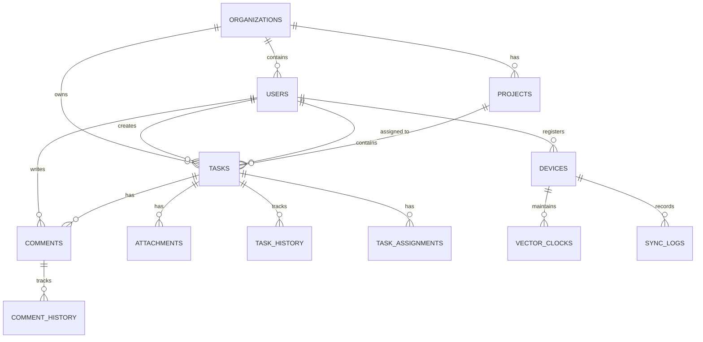

# Database Schema Design

## Overview

This document details the complete database schemas for both client-side (IndexedDB) and server-side (PostgreSQL) storage, designed for optimal offline-first synchronization.

---

## Entity Relationship Diagram



---

## PostgreSQL Schema (Server-Side)

### Core Tables

#### 1. organizations

| Column | Type | Constraints | Description |
|--------|------|-------------|-------------|
| id | UUID | PRIMARY KEY | Organization unique identifier |
| name | VARCHAR(255) | NOT NULL | Organization name |
| slug | VARCHAR(100) | NOT NULL UNIQUE | URL-friendly identifier |
| settings | JSONB | DEFAULT '{}' | Organization settings |
| storage_quota_mb | INTEGER | DEFAULT 10240 | Storage limit in MB |
| storage_used_mb | DECIMAL(10,2) | DEFAULT 0 | Current storage usage |
| created_at | TIMESTAMPTZ | DEFAULT NOW() | Creation timestamp |
| updated_at | TIMESTAMPTZ | DEFAULT NOW() | Last update timestamp |
| deleted_at | TIMESTAMPTZ | NULL | Soft delete timestamp |

**Indexes:**
```sql
CREATE INDEX idx_organizations_slug ON organizations(slug);
CREATE INDEX idx_organizations_deleted_at ON organizations(deleted_at) WHERE deleted_at IS NULL;
```

---

#### 2. users

| Column | Type | Constraints | Description |
|--------|------|-------------|-------------|
| id | UUID | PRIMARY KEY | User unique identifier |
| organization_id | UUID | NOT NULL REFERENCES organizations(id) | Parent organization |
| email | VARCHAR(255) | NOT NULL | User email address |
| name | VARCHAR(255) | NOT NULL | Full name |
| avatar_url | TEXT | NULL | Profile picture URL |
| role | VARCHAR(50) | DEFAULT 'member' | Role: admin, manager, member |
| is_active | BOOLEAN | DEFAULT true | Account active status |
| last_seen_at | TIMESTAMPTZ | NULL | Last activity timestamp |
| created_at | TIMESTAMPTZ | DEFAULT NOW() | Account creation time |
| updated_at | TIMESTAMPTZ | DEFAULT NOW() | Last update time |
| deleted_at | TIMESTAMPTZ | NULL | Soft delete timestamp |

**Indexes:**
```sql
CREATE UNIQUE INDEX idx_users_email_org ON users(email, organization_id) WHERE deleted_at IS NULL;
CREATE INDEX idx_users_org_id ON users(organization_id);
CREATE INDEX idx_users_last_seen ON users(last_seen_at);
```

---

#### 3. devices

Tracks individual devices for vector clock synchronization.

| Column | Type | Constraints | Description |
|--------|------|-------------|-------------|
| id | UUID | PRIMARY KEY | Device unique identifier |
| user_id | UUID | NOT NULL REFERENCES users(id) | Device owner |
| device_name | VARCHAR(255) | NULL | User-friendly device name |
| device_fingerprint | VARCHAR(255) | NOT NULL | Browser/device fingerprint |
| last_sync_at | TIMESTAMPTZ | NULL | Last successful sync time |
| vector_clock | JSONB | DEFAULT '{}' | Current vector clock state |
| is_active | BOOLEAN | DEFAULT true | Device active status |
| created_at | TIMESTAMPTZ | DEFAULT NOW() | First registration time |
| updated_at | TIMESTAMPTZ | DEFAULT NOW() | Last update time |

**Indexes:**
```sql
CREATE INDEX idx_devices_user_id ON devices(user_id);
CREATE INDEX idx_devices_fingerprint ON devices(device_fingerprint);
CREATE INDEX idx_devices_last_sync ON devices(last_sync_at);
```

---

#### 4. projects

Optional project grouping for tasks.

| Column | Type | Constraints | Description |
|--------|------|-------------|-------------|
| id | UUID | PRIMARY KEY | Project unique identifier |
| organization_id | UUID | NOT NULL REFERENCES organizations(id) | Parent organization |
| name | VARCHAR(255) | NOT NULL | Project name |
| description | TEXT | NULL | Project description |
| color | VARCHAR(7) | DEFAULT '#3B82F6' | Hex color code |
| is_archived | BOOLEAN | DEFAULT false | Archive status |
| created_by | UUID | NOT NULL REFERENCES users(id) | Creator user ID |
| created_at | TIMESTAMPTZ | DEFAULT NOW() | Creation time |
| updated_at | TIMESTAMPTZ | DEFAULT NOW() | Last update time |
| deleted_at | TIMESTAMPTZ | NULL | Soft delete timestamp |

**Indexes:**
```sql
CREATE INDEX idx_projects_org_id ON projects(organization_id);
CREATE INDEX idx_projects_archived ON projects(is_archived);
```

---

#### 5. tasks

Core task entity with sync metadata.

| Column | Type | Constraints | Description |
|--------|------|-------------|-------------|
| id | UUID | PRIMARY KEY | Task unique identifier |
| organization_id | UUID | NOT NULL REFERENCES organizations(id) | Parent organization |
| project_id | UUID | NULL REFERENCES projects(id) | Parent project (optional) |
| title | VARCHAR(500) | NOT NULL | Task title |
| description | TEXT | NULL | Task description (markdown) |
| status | VARCHAR(50) | DEFAULT 'todo' | Status: todo, in_progress, done |
| priority | VARCHAR(50) | DEFAULT 'medium' | Priority: low, medium, high, urgent |
| due_date | TIMESTAMPTZ | NULL | Due date/time |
| completed_at | TIMESTAMPTZ | NULL | Completion timestamp |
| position | DECIMAL(20,10) | NOT NULL | Sort position (fractional index) |
| created_by | UUID | NOT NULL REFERENCES users(id) | Creator user ID |
| assigned_to | UUID | NULL REFERENCES users(id) | Currently assigned user |
| tags | TEXT[] | DEFAULT '{}' | Array of tag strings |
| custom_fields | JSONB | DEFAULT '{}' | Extensible metadata |
| version | INTEGER | DEFAULT 1 | Optimistic locking version |
| vector_clock | JSONB | NOT NULL DEFAULT '{}' | Causality tracking |
| last_modified_by | UUID | NOT NULL REFERENCES users(id) | Last editor |
| last_modified_device | UUID | NULL REFERENCES devices(id) | Last editing device |
| checksum | VARCHAR(64) | NULL | SHA-256 content hash |
| created_at | TIMESTAMPTZ | DEFAULT NOW() | Creation time |
| updated_at | TIMESTAMPTZ | DEFAULT NOW() | Last update time |
| deleted_at | TIMESTAMPTZ | NULL | Soft delete timestamp |

**Indexes:**
```sql
CREATE INDEX idx_tasks_org_id ON tasks(organization_id);
CREATE INDEX idx_tasks_project_id ON tasks(project_id);
CREATE INDEX idx_tasks_assigned_to ON tasks(assigned_to);
CREATE INDEX idx_tasks_status ON tasks(status);
CREATE INDEX idx_tasks_due_date ON tasks(due_date) WHERE due_date IS NOT NULL;
CREATE INDEX idx_tasks_updated_at ON tasks(updated_at);
CREATE INDEX idx_tasks_deleted_at ON tasks(deleted_at) WHERE deleted_at IS NULL;
CREATE INDEX idx_tasks_tags ON tasks USING GIN(tags);
CREATE INDEX idx_tasks_vector_clock ON tasks USING GIN(vector_clock);
CREATE INDEX idx_tasks_full_text ON tasks USING GIN(to_tsvector('english', title || ' ' || COALESCE(description, '')));
```

**Constraints:**
```sql
ALTER TABLE tasks ADD CONSTRAINT chk_tasks_status
    CHECK (status IN ('todo', 'in_progress', 'done', 'blocked', 'cancelled'));

ALTER TABLE tasks ADD CONSTRAINT chk_tasks_priority
    CHECK (priority IN ('low', 'medium', 'high', 'urgent'));
```

---

#### 6. task_assignments

Tracks assignment history for conflict resolution.

| Column | Type | Constraints | Description |
|--------|------|-------------|-------------|
| id | UUID | PRIMARY KEY | Assignment unique identifier |
| task_id | UUID | NOT NULL REFERENCES tasks(id) | Parent task |
| user_id | UUID | NULL REFERENCES users(id) | Assigned user (NULL = unassigned) |
| assigned_by | UUID | NOT NULL REFERENCES users(id) | User who made assignment |
| assigned_from_device | UUID | NULL REFERENCES devices(id) | Device that made assignment |
| vector_clock | JSONB | NOT NULL DEFAULT '{}' | Assignment causality |
| created_at | TIMESTAMPTZ | DEFAULT NOW() | Assignment time |
| superseded_at | TIMESTAMPTZ | NULL | When replaced by newer assignment |

**Indexes:**
```sql
CREATE INDEX idx_task_assignments_task_id ON task_assignments(task_id);
CREATE INDEX idx_task_assignments_user_id ON task_assignments(user_id);
CREATE INDEX idx_task_assignments_created_at ON task_assignments(created_at DESC);
CREATE INDEX idx_task_assignments_superseded ON task_assignments(superseded_at) WHERE superseded_at IS NULL;
```

---

#### 7. comments

Task comments with edit history.

| Column | Type | Constraints | Description |
|--------|------|-------------|-------------|
| id | UUID | PRIMARY KEY | Comment unique identifier |
| task_id | UUID | NOT NULL REFERENCES tasks(id) | Parent task |
| user_id | UUID | NOT NULL REFERENCES users(id) | Comment author |
| content | TEXT | NOT NULL | Comment text (markdown) |
| parent_id | UUID | NULL REFERENCES comments(id) | Parent comment (threading) |
| version | INTEGER | DEFAULT 1 | Edit version number |
| vector_clock | JSONB | NOT NULL DEFAULT '{}' | Causality tracking |
| last_modified_by | UUID | NOT NULL REFERENCES users(id) | Last editor |
| last_modified_device | UUID | NULL REFERENCES devices(id) | Last editing device |
| is_edited | BOOLEAN | DEFAULT false | Edit indicator |
| created_at | TIMESTAMPTZ | DEFAULT NOW() | Creation time |
| updated_at | TIMESTAMPTZ | DEFAULT NOW() | Last update time |
| deleted_at | TIMESTAMPTZ | NULL | Soft delete timestamp |

**Indexes:**
```sql
CREATE INDEX idx_comments_task_id ON comments(task_id);
CREATE INDEX idx_comments_user_id ON comments(user_id);
CREATE INDEX idx_comments_parent_id ON comments(parent_id);
CREATE INDEX idx_comments_updated_at ON comments(updated_at);
CREATE INDEX idx_comments_deleted_at ON comments(deleted_at) WHERE deleted_at IS NULL;
```

---

#### 8. comment_history

Preserves all comment edit versions.

| Column | Type | Constraints | Description |
|--------|------|-------------|-------------|
| id | UUID | PRIMARY KEY | History entry ID |
| comment_id | UUID | NOT NULL REFERENCES comments(id) | Parent comment |
| content | TEXT | NOT NULL | Historical content |
| version | INTEGER | NOT NULL | Version number |
| edited_by | UUID | NOT NULL REFERENCES users(id) | Editor user ID |
| edited_from_device | UUID | NULL REFERENCES devices(id) | Editing device |
| vector_clock | JSONB | NOT NULL | Version causality |
| created_at | TIMESTAMPTZ | DEFAULT NOW() | Edit timestamp |

**Indexes:**
```sql
CREATE INDEX idx_comment_history_comment_id ON comment_history(comment_id);
CREATE INDEX idx_comment_history_version ON comment_history(comment_id, version);
```

---

#### 9. attachments

File attachments with metadata.

| Column | Type | Constraints | Description |
|--------|------|-------------|-------------|
| id | UUID | PRIMARY KEY | Attachment unique identifier |
| task_id | UUID | NOT NULL REFERENCES tasks(id) | Parent task |
| user_id | UUID | NOT NULL REFERENCES users(id) | Uploader |
| filename | VARCHAR(255) | NOT NULL | Original filename |
| file_size | BIGINT | NOT NULL | Size in bytes |
| mime_type | VARCHAR(100) | NOT NULL | MIME type |
| storage_key | VARCHAR(500) | NOT NULL | S3/storage key |
| thumbnail_key | VARCHAR(500) | NULL | Thumbnail storage key |
| upload_status | VARCHAR(50) | DEFAULT 'pending' | Status: pending, uploading, completed, failed |
| chunks_total | INTEGER | NULL | Total chunks (for resumable) |
| chunks_uploaded | INTEGER | DEFAULT 0 | Uploaded chunks |
| checksum_sha256 | VARCHAR(64) | NOT NULL | File integrity hash |
| vector_clock | JSONB | NOT NULL DEFAULT '{}' | Causality tracking |
| uploaded_from_device | UUID | NULL REFERENCES devices(id) | Upload device |
| created_at | TIMESTAMPTZ | DEFAULT NOW() | Upload initiation time |
| completed_at | TIMESTAMPTZ | NULL | Upload completion time |
| deleted_at | TIMESTAMPTZ | NULL | Soft delete timestamp |

**Indexes:**
```sql
CREATE INDEX idx_attachments_task_id ON attachments(task_id);
CREATE INDEX idx_attachments_user_id ON attachments(user_id);
CREATE INDEX idx_attachments_storage_key ON attachments(storage_key);
CREATE INDEX idx_attachments_upload_status ON attachments(upload_status);
CREATE INDEX idx_attachments_deleted_at ON attachments(deleted_at) WHERE deleted_at IS NULL;
```

---

#### 10. task_history

Complete audit trail of task changes.

| Column | Type | Constraints | Description |
|--------|------|-------------|-------------|
| id | UUID | PRIMARY KEY | History entry ID |
| task_id | UUID | NOT NULL REFERENCES tasks(id) | Parent task |
| user_id | UUID | NOT NULL REFERENCES users(id) | User who made change |
| device_id | UUID | NULL REFERENCES devices(id) | Device that made change |
| change_type | VARCHAR(50) | NOT NULL | Type: created, updated, deleted, restored |
| changes | JSONB | NOT NULL | Diff of changes |
| previous_state | JSONB | NULL | Full previous state |
| vector_clock | JSONB | NOT NULL | Change causality |
| created_at | TIMESTAMPTZ | DEFAULT NOW() | Change timestamp |

**Indexes:**
```sql
CREATE INDEX idx_task_history_task_id ON task_history(task_id);
CREATE INDEX idx_task_history_user_id ON task_history(user_id);
CREATE INDEX idx_task_history_created_at ON task_history(created_at DESC);
CREATE INDEX idx_task_history_change_type ON task_history(change_type);
```

---

### Sync Metadata Tables

#### 11. sync_logs

Tracks synchronization events for debugging and monitoring.

| Column | Type | Constraints | Description |
|--------|------|-------------|-------------|
| id | UUID | PRIMARY KEY | Log entry ID |
| device_id | UUID | NOT NULL REFERENCES devices(id) | Syncing device |
| user_id | UUID | NOT NULL REFERENCES users(id) | Device owner |
| sync_type | VARCHAR(50) | NOT NULL | Type: push, pull, conflict |
| entities_pushed | INTEGER | DEFAULT 0 | Number of entities sent |
| entities_pulled | INTEGER | DEFAULT 0 | Number of entities received |
| conflicts_detected | INTEGER | DEFAULT 0 | Number of conflicts |
| conflicts_resolved | INTEGER | DEFAULT 0 | Auto-resolved conflicts |
| duration_ms | INTEGER | NULL | Sync duration |
| status | VARCHAR(50) | NOT NULL | Status: success, partial, failed |
| error_message | TEXT | NULL | Error details |
| metadata | JSONB | DEFAULT '{}' | Additional context |
| created_at | TIMESTAMPTZ | DEFAULT NOW() | Sync start time |
| completed_at | TIMESTAMPTZ | NULL | Sync completion time |

**Indexes:**
```sql
CREATE INDEX idx_sync_logs_device_id ON sync_logs(device_id);
CREATE INDEX idx_sync_logs_user_id ON sync_logs(user_id);
CREATE INDEX idx_sync_logs_created_at ON sync_logs(created_at DESC);
CREATE INDEX idx_sync_logs_status ON sync_logs(status);
```

---

#### 12. conflicts

Stores unresolved conflicts requiring user intervention.

| Column | Type | Constraints | Description |
|--------|------|-------------|-------------|
| id | UUID | PRIMARY KEY | Conflict ID |
| entity_type | VARCHAR(50) | NOT NULL | Type: task, comment, attachment |
| entity_id | UUID | NOT NULL | Conflicting entity ID |
| device_id | UUID | NOT NULL REFERENCES devices(id) | Device that detected conflict |
| user_id | UUID | NOT NULL REFERENCES users(id) | User who needs to resolve |
| local_version | JSONB | NOT NULL | Client version of entity |
| server_version | JSONB | NOT NULL | Server version of entity |
| local_vector_clock | JSONB | NOT NULL | Local causality |
| server_vector_clock | JSONB | NOT NULL | Server causality |
| conflict_reason | TEXT | NULL | Human-readable explanation |
| resolution_strategy | VARCHAR(50) | NULL | How resolved: manual, auto_merge, local_wins, server_wins |
| resolved_version | JSONB | NULL | Final resolved state |
| resolved_by | UUID | NULL REFERENCES users(id) | User who resolved |
| created_at | TIMESTAMPTZ | DEFAULT NOW() | Conflict detection time |
| resolved_at | TIMESTAMPTZ | NULL | Resolution time |

**Indexes:**
```sql
CREATE INDEX idx_conflicts_entity ON conflicts(entity_type, entity_id);
CREATE INDEX idx_conflicts_user_id ON conflicts(user_id);
CREATE INDEX idx_conflicts_created_at ON conflicts(created_at DESC);
CREATE INDEX idx_conflicts_resolved_at ON conflicts(resolved_at) WHERE resolved_at IS NULL;
```

---

#### 13. tombstones

Tracks deleted entities for proper sync propagation.

| Column | Type | Constraints | Description |
|--------|------|-------------|-------------|
| id | UUID | PRIMARY KEY | Tombstone ID |
| entity_type | VARCHAR(50) | NOT NULL | Type: task, comment, attachment |
| entity_id | UUID | NOT NULL | Deleted entity ID |
| organization_id | UUID | NOT NULL REFERENCES organizations(id) | Parent org |
| deleted_by | UUID | NOT NULL REFERENCES users(id) | User who deleted |
| deleted_from_device | UUID | NULL REFERENCES devices(id) | Deletion device |
| vector_clock | JSONB | NOT NULL | Deletion causality |
| entity_snapshot | JSONB | NULL | Pre-deletion state |
| created_at | TIMESTAMPTZ | DEFAULT NOW() | Deletion time |
| expires_at | TIMESTAMPTZ | NOT NULL | Tombstone expiry (90 days) |

**Indexes:**
```sql
CREATE INDEX idx_tombstones_entity ON tombstones(entity_type, entity_id);
CREATE INDEX idx_tombstones_org_id ON tombstones(organization_id);
CREATE INDEX idx_tombstones_created_at ON tombstones(created_at DESC);
CREATE INDEX idx_tombstones_expires_at ON tombstones(expires_at);
```

---

## IndexedDB Schema (Client-Side)

### Object Stores

#### 1. tasks

```typescript
interface Task {
  id: string; // UUID
  organizationId: string;
  projectId: string | null;
  title: string;
  description: string | null;
  status: 'todo' | 'in_progress' | 'done' | 'blocked' | 'cancelled';
  priority: 'low' | 'medium' | 'high' | 'urgent';
  dueDate: number | null; // Unix timestamp
  completedAt: number | null;
  position: number; // Fractional index
  createdBy: string;
  assignedTo: string | null;
  tags: string[];
  customFields: Record<string, any>;
  version: number;
  vectorClock: Record<string, number>; // deviceId -> counter
  lastModifiedBy: string;
  lastModifiedDevice: string;
  checksum: string;
  createdAt: number; // Unix timestamp
  updatedAt: number;
  deletedAt: number | null;

  // Client-only fields
  _syncStatus: 'synced' | 'pending' | 'syncing' | 'conflict';
  _locallyModified: boolean;
  _conflictId: string | null;
}
```

**Indexes:**
- `organizationId` (multiEntry: false)
- `projectId` (multiEntry: false)
- `assignedTo` (multiEntry: false)
- `status` (multiEntry: false)
- `updatedAt` (multiEntry: false)
- `_syncStatus` (multiEntry: false)
- `[organizationId+status]` (compound)
- `[organizationId+assignedTo]` (compound)

---

#### 2. comments

```typescript
interface Comment {
  id: string;
  taskId: string;
  userId: string;
  content: string;
  parentId: string | null;
  version: number;
  vectorClock: Record<string, number>;
  lastModifiedBy: string;
  lastModifiedDevice: string;
  isEdited: boolean;
  createdAt: number;
  updatedAt: number;
  deletedAt: number | null;

  // Client-only
  _syncStatus: 'synced' | 'pending' | 'syncing' | 'conflict';
  _locallyModified: boolean;
}
```

**Indexes:**
- `taskId` (multiEntry: false)
- `userId` (multiEntry: false)
- `updatedAt` (multiEntry: false)
- `_syncStatus` (multiEntry: false)

---

#### 3. attachments

```typescript
interface Attachment {
  id: string;
  taskId: string;
  userId: string;
  filename: string;
  fileSize: number;
  mimeType: string;
  storageKey: string;
  thumbnailKey: string | null;
  uploadStatus: 'pending' | 'uploading' | 'completed' | 'failed';
  chunksTotal: number | null;
  chunksUploaded: number;
  checksumSha256: string;
  vectorClock: Record<string, number>;
  uploadedFromDevice: string;
  createdAt: number;
  completedAt: number | null;
  deletedAt: number | null;

  // Client-only
  _localFile: File | null; // For uploads
  _cacheBlob: Blob | null; // Cached file data
  _syncStatus: 'synced' | 'pending' | 'syncing' | 'conflict';
  _uploadProgress: number; // 0-100
}
```

**Indexes:**
- `taskId` (multiEntry: false)
- `uploadStatus` (multiEntry: false)
- `_syncStatus` (multiEntry: false)

---

#### 4. users

```typescript
interface User {
  id: string;
  organizationId: string;
  email: string;
  name: string;
  avatarUrl: string | null;
  role: 'admin' | 'manager' | 'member';
  isActive: boolean;
  lastSeenAt: number | null;
  createdAt: number;
  updatedAt: number;
}
```

**Indexes:**
- `organizationId` (multiEntry: false)
- `email` (multiEntry: false)

---

#### 5. projects

```typescript
interface Project {
  id: string;
  organizationId: string;
  name: string;
  description: string | null;
  color: string;
  isArchived: boolean;
  createdBy: string;
  createdAt: number;
  updatedAt: number;
  deletedAt: number | null;
}
```

**Indexes:**
- `organizationId` (multiEntry: false)

---

#### 6. sync_queue

```typescript
interface SyncQueueItem {
  id: string; // Auto-generated
  entityType: 'task' | 'comment' | 'attachment';
  entityId: string;
  operation: 'create' | 'update' | 'delete';
  priority: number; // 1 (high) to 5 (low)
  payload: any; // Full entity data
  retryCount: number;
  maxRetries: number;
  lastAttemptAt: number | null;
  status: 'pending' | 'processing' | 'failed' | 'completed';
  errorMessage: string | null;
  createdAt: number;
}
```

**Indexes:**
- `status` (multiEntry: false)
- `priority` (multiEntry: false)
- `[status+priority]` (compound)
- `entityType` (multiEntry: false)

---

#### 7. vector_clock_state

```typescript
interface VectorClockState {
  deviceId: string; // Primary key
  counter: number; // Local counter
  lastSyncedClock: Record<string, number>; // All known device clocks
  updatedAt: number;
}
```

---

#### 8. conflict_queue

```typescript
interface ConflictQueueItem {
  id: string;
  entityType: 'task' | 'comment' | 'attachment';
  entityId: string;
  localVersion: any;
  serverVersion: any;
  localVectorClock: Record<string, number>;
  serverVectorClock: Record<string, number>;
  conflictReason: string;
  autoResolvable: boolean;
  suggestedResolution: any | null;
  createdAt: number;
  userNotified: boolean;
}
```

**Indexes:**
- `entityType` (multiEntry: false)
- `autoResolvable` (multiEntry: false)
- `userNotified` (multiEntry: false)

---

#### 9. tombstones

```typescript
interface Tombstone {
  id: string;
  entityType: 'task' | 'comment' | 'attachment';
  entityId: string;
  deletedBy: string;
  deletedFromDevice: string;
  vectorClock: Record<string, number>;
  createdAt: number;
  expiresAt: number;
}
```

**Indexes:**
- `entityType` (multiEntry: false)
- `entityId` (multiEntry: false)
- `expiresAt` (multiEntry: false)

---

#### 10. cache_metadata

```typescript
interface CacheMetadata {
  key: string; // Primary key
  value: any;
  expiresAt: number | null;
  updatedAt: number;
}
```

**Indexes:**
- `expiresAt` (multiEntry: false)

---

## Schema Migration Strategy

### Server-Side (PostgreSQL)

Use a migration tool like **Flyway**, **Liquibase**, or **TypeORM migrations**:

```sql
-- Example migration V1__initial_schema.sql
BEGIN;

CREATE EXTENSION IF NOT EXISTS "uuid-ossp";
CREATE EXTENSION IF NOT EXISTS "pg_trgm"; -- For full-text search

-- Create all tables as defined above...

COMMIT;
```

**Version Tracking Table:**
```sql
CREATE TABLE schema_migrations (
  version VARCHAR(50) PRIMARY KEY,
  applied_at TIMESTAMPTZ DEFAULT NOW(),
  description TEXT
);
```

---

### Client-Side (IndexedDB)

Use versioning with upgrade transactions:

```typescript
const DB_NAME = 'TaskManagerDB';
const DB_VERSION = 1;

function openDatabase(): Promise<IDBDatabase> {
  return new Promise((resolve, reject) => {
    const request = indexedDB.open(DB_NAME, DB_VERSION);

    request.onupgradeneeded = (event) => {
      const db = (event.target as IDBOpenDBRequest).result;

      if (event.oldVersion < 1) {
        // Create tasks store
        const taskStore = db.createObjectStore('tasks', { keyPath: 'id' });
        taskStore.createIndex('organizationId', 'organizationId');
        taskStore.createIndex('projectId', 'projectId');
        taskStore.createIndex('assignedTo', 'assignedTo');
        taskStore.createIndex('status', 'status');
        taskStore.createIndex('updatedAt', 'updatedAt');
        taskStore.createIndex('_syncStatus', '_syncStatus');
        taskStore.createIndex('org_status', ['organizationId', 'status']);

        // Create other stores...
      }

      // Future migrations
      // if (event.oldVersion < 2) { ... }
    };

    request.onsuccess = () => resolve(request.result);
    request.onerror = () => reject(request.error);
  });
}
```

---

## Data Size Estimations

### Typical Organization (25 users, 10,000 tasks)

**PostgreSQL Storage:**
- tasks: ~150 bytes/row × 10,000 = 1.5 MB
- comments: ~200 bytes/row × 50,000 (5/task) = 10 MB
- attachments metadata: ~300 bytes/row × 5,000 = 1.5 MB
- task_history: ~400 bytes/row × 100,000 = 40 MB
- sync_logs: ~250 bytes/row × 1M = 250 MB
- **Total DB: ~300 MB** (with indexes ~600 MB)

**IndexedDB per Device:**
- User's assigned tasks (~200): 30 KB
- Recently viewed tasks (~500): 75 KB
- Comments cache: 100 KB
- Attachment metadata: 20 KB
- Sync metadata: 50 KB
- **Total: ~275 KB** (minimal storage footprint)

**Object Storage (Attachments):**
- Average attachment: 2 MB
- 5,000 attachments = 10 GB

---

## Performance Optimization

### PostgreSQL Query Patterns

**1. Fetch changes since last sync:**
```sql
-- Optimized with covering index
SELECT id, title, status, assigned_to, vector_clock, updated_at
FROM tasks
WHERE organization_id = $1
  AND updated_at > $2
  AND deleted_at IS NULL
ORDER BY updated_at ASC
LIMIT 100;
```

**2. Conflict detection:**
```sql
-- Check for concurrent modifications
SELECT id, vector_clock, version
FROM tasks
WHERE id = ANY($1) -- Array of task IDs
  AND updated_at > $2 -- Client's last sync time
FOR UPDATE SKIP LOCKED;
```

**3. Full-text search:**
```sql
-- Using GIN index on tsvector
SELECT id, title, ts_rank(to_tsvector('english', title || ' ' || description), query) AS rank
FROM tasks, plainto_tsquery('english', $1) query
WHERE organization_id = $2
  AND to_tsvector('english', title || ' ' || description) @@ query
  AND deleted_at IS NULL
ORDER BY rank DESC
LIMIT 20;
```

---

### IndexedDB Query Patterns

**1. Get user's tasks:**
```typescript
// Use compound index for optimal performance
const index = db.transaction('tasks').objectStore('tasks')
  .index('org_status');
const range = IDBKeyRange.bound(
  [organizationId, 'todo'],
  [organizationId, 'done']
);
const tasks = await index.getAll(range);
```

**2. Get pending sync items:**
```typescript
// Use compound index for priority sorting
const index = db.transaction('sync_queue').objectStore('sync_queue')
  .index('status_priority');
const range = IDBKeyRange.bound(['pending', 1], ['pending', 5]);
const items = await index.getAll(range, 50); // Batch of 50
```

---

## Security Considerations

1. **Row-Level Security (PostgreSQL):**
```sql
ALTER TABLE tasks ENABLE ROW LEVEL SECURITY;

CREATE POLICY tasks_org_isolation ON tasks
  USING (organization_id = current_setting('app.current_org_id')::uuid);
```

2. **Encryption:**
- Attachment content encrypted in S3 using AES-256
- Sensitive fields in PostgreSQL encrypted using `pgcrypto`
- IndexedDB not encrypted (relies on device-level encryption)

3. **Data Sanitization:**
- All text fields sanitized to prevent XSS
- Markdown content processed with DOMPurify before rendering
- File uploads scanned for malware before storing

---

**Next Document**: SYNC_STRATEGY.md
