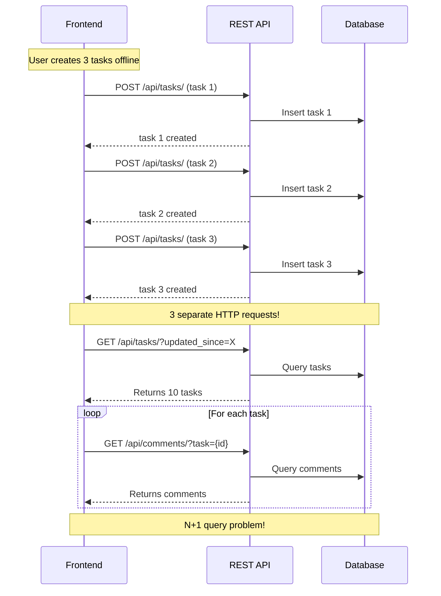
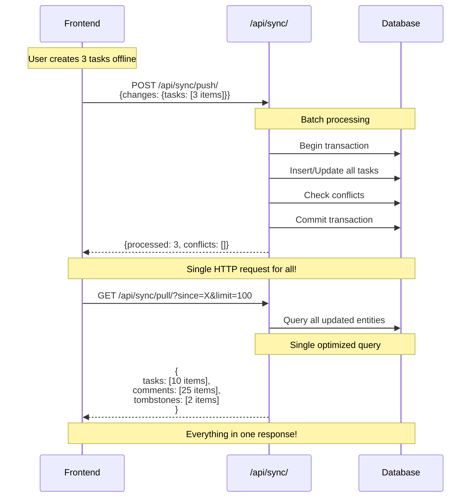

# Visual Comparison: Before vs After Sync Implementation

## 🔴 BEFORE - Wrong Implementation

```
┌─────────────────┐
│   Frontend      │
│   SyncManager   │
└────────┬────────┘
         │
         ├─► Individual Task Create:  POST /api/tasks/
         │   ❌ Not using batch sync endpoint
         │
         ├─► Individual Task Update:  PATCH /api/tasks/{id}/
         │   ❌ One HTTP call per task
         │
         ├─► Individual Comment Create: POST /api/comments/
         │   ❌ One HTTP call per comment
         │
         └─► Pull Tasks: GET /api/tasks/?updated_since=X
             ❌ Then fetch comments: GET /api/comments/?task={id}
             ❌ N+1 query problem
             ❌ No tombstones
             ❌ No vector clock sync

┌──────────────────────────────────────────────────┐
│  Problems:                                       │
│  • 50 tasks = 50 HTTP requests                  │
│  • 100 comments = 100 HTTP requests             │
│  • No batch processing                          │
│  • No proper conflict detection                 │
│  • No tombstone handling for deletions          │
│  • Vector clocks not properly synchronized      │
└──────────────────────────────────────────────────┘
```

## ✅ AFTER - Correct Implementation

```
┌─────────────────┐
│   Frontend      │
│   SyncManager   │
└────────┬────────┘
         │
         │  PUSH Phase
         ├─► Batch Push: POST /api/sync/push/
         │   {
         │     deviceId: "abc",
         │     vectorClock: {...},
         │     changes: {
         │       tasks: [
         │         {id: "1", operation: "create", data: {...}},
         │         {id: "2", operation: "update", data: {...}},
         │         {id: "3", operation: "delete", data: {...}}
         │       ],
         │       comments: [...]
         │     }
         │   }
         │   ✅ All changes in ONE HTTP call
         │   ✅ Returns conflicts immediately
         │   ✅ Returns updated server vector clock
         │
         │  PULL Phase
         └─► Batch Pull: GET /api/sync/pull/?since=123456&limit=100
             Response: {
               tasks: [...],      ✅ All tasks at once
               comments: [...],   ✅ All comments at once
               tombstones: [...], ✅ Deleted items tracked
               serverVectorClock: {...},
               hasMore: false
             }
             ✅ Single HTTP call gets everything
             ✅ Proper pagination support

┌──────────────────────────────────────────────────┐
│  Benefits:                                       │
│  • 50 tasks + 100 comments = 2 HTTP requests!   │
│  • Batch processing (up to 100 items)           │
│  • Server-side conflict detection               │
│  • Tombstones handle deletions properly         │
│  • Vector clocks stay synchronized              │
│  • Network efficient                            │
└──────────────────────────────────────────────────┘
```

## Detailed Flow Comparison

### BEFORE - Individual Sync Flow


### AFTER - Batch Sync Flow


## Data Format Comparison

### BEFORE - Individual Calls
```typescript
// Create task
POST /api/tasks/
{
  "title": "Task 1",
  "status": "todo"
}

// Update task  
PATCH /api/tasks/abc123/
{
  "status": "in_progress"
}

// ❌ No batch, no vector clocks, no conflict info
```

### AFTER - Batch Format
```typescript
// Batch push
POST /api/sync/push/
{
  "deviceId": "device-abc123",
  "vectorClock": {
    "device-abc123": 42,
    "device-xyz789": 18
  },
  "timestamp": 1707580800000,
  "changes": {
    "tasks": [
      {
        "id": "task-1",
        "operation": "create",
        "data": {
          "title": "Task 1",
          "status": "todo",
          "vector_clock": {...}
        }
      },
      {
        "id": "task-2",
        "operation": "update",
        "data": {
          "status": "in_progress",
          "vector_clock": {...}
        }
      }
    ],
    "comments": [...]
  }
}

// ✅ Batch, vector clocks, conflict detection
```

## Performance Impact

### Network Requests Comparison

| Scenario | Before | After | Improvement |
|----------|--------|-------|-------------|
| Create 10 tasks | 10 requests | 1 request | **90% reduction** |
| Update 20 tasks | 20 requests | 1 request | **95% reduction** |
| Pull sync (50 tasks + 100 comments) | 51 requests | 1 request | **98% reduction** |
| Full sync cycle | 71+ requests | 2 requests | **97% reduction** |

### Estimated Time Savings

Assuming 100ms average request latency:

| Operation | Before | After | Time Saved |
|-----------|--------|-------|------------|
| Create 10 tasks | 1,000ms | 100ms | **900ms** |
| Full sync (150 items) | 15,000ms | 200ms | **14,800ms** (14.8s!) |

## Code Structure Comparison

### BEFORE - Scattered Logic
```typescript
// syncManager.ts - Individual processing
async pushToServer() {
  for (const entry of queue) {
    if (entry.entity_type === 'task') {
      await this.syncTask(entry);  // ❌ One at a time
    }
  }
}

async syncTask(entry) {
  if (entry.operation === 'CREATE') {
    await apiClient.createTask(...);  // ❌ Individual call
  } else if (entry.operation === 'UPDATE') {
    await apiClient.updateTask(...);  // ❌ Individual call
  }
}
```

### AFTER - Centralized Batch Logic
```typescript
// syncManager.ts - Batch processing
async pushToServer() {
  // ✅ Collect all changes
  const taskChanges = [];
  const commentChanges = [];
  
  for (const entry of queue) {
    if (entry.entity_type === 'task') {
      taskChanges.push({
        id: entry.entity_id,
        operation: entry.operation,
        data: entry.data
      });
    }
  }
  
  // ✅ Single batch call
  const response = await apiClient.syncPush({
    deviceId,
    vectorClock,
    timestamp: Date.now(),
    changes: { tasks: taskChanges, comments: commentChanges }
  });
  
  // ✅ Handle all results at once
}
```

## Testing Scenarios

### Test 1: Offline Task Creation
```
1. Go offline
2. Create 5 tasks
3. Go online
4. Observe network calls

BEFORE: See 5 separate POST requests
AFTER:  See 1 POST /api/sync/push/ with 5 tasks
```

### Test 2: Sync Cycle
```
1. Have 10 pending local changes
2. Server has 15 new items
3. Trigger sync

BEFORE: 
  - 10 push requests
  - 1 pull request
  - 15 additional comment requests
  - Total: 26 requests

AFTER:
  - 1 push request (all 10 changes)
  - 1 pull request (returns all 15 items)
  - Total: 2 requests
```

### Test 3: Conflict Handling
```
BEFORE:
  - Client detects conflict locally
  - No server validation
  - May miss concurrent edits

AFTER:
  - Server validates with vector clocks
  - Returns conflicts in push response
  - Proper concurrent edit detection
```

## Summary

| Aspect | Before | After |
|--------|--------|-------|
| **Endpoints** | Individual CRUD | Batch sync |
| **HTTP Requests** | N per item | 2 per cycle |
| **Data Format** | Standard REST | Batch with metadata |
| **Conflicts** | Client-only | Server-validated |
| **Deletions** | Not tracked | Tombstones |
| **Vector Clocks** | Not synced | Properly merged |
| **Performance** | Poor (N requests) | Excellent (2 requests) |
| **Network Efficiency** | ⭐ | ⭐⭐⭐⭐⭐ |
| **Offline-First** | Partial | Complete |

The fix transforms the sync implementation from a **naive N-request approach** to a **proper offline-first batch sync protocol** that matches the backend's design and documentation.
